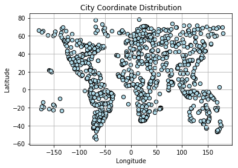
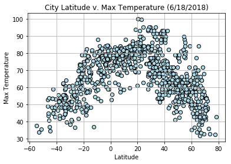
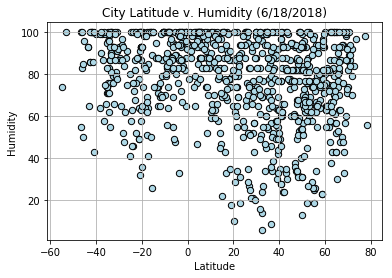
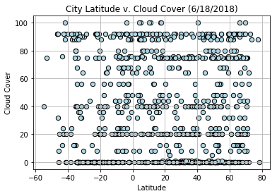
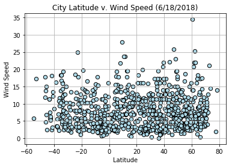

# Observations

* City temperature peak approaching +25 N latitude, rather than at the equator. This is likely because the data was pulled in June 18, 2018, a few days before the Northern Hemisphere's Summer Equinox. A year-long average would likely yield a peak at the equator, but that historical data is not available from the free tier of the Open Weather Map API.

* City temperatures in the southern hemisphere are more tightly clustered than in northern hemisphere cities, with fewer significant outliers from the trendline. This is likely due to narrower non-Antarctic landmasses in the Southern Hemisphere. On the City Coordinate Distribution chart, the city locations are displayed in a manner that mirrors a world map. The negative latitude cities are clustered longtitudinally around -60 W (South America), +25 E (Subequatorial Africa), and +150 E (Oceania and much of Indonesia). Positive latitude cities have a much more broad and even longitudinal distribution, reflecting more available landmass East-West.

* Humidity, Wind Speed, and Cloud Cover do not have any discernable relationship with Latitude.

```python
#import dependencies

import matplotlib.pyplot as plt
from pprint import pprint
import json
import random
import numpy as np
import pandas as pd
from owm_api import key
from citipy import citipy
import requests
```


```python
# Step 1: Generate list of random cities

#Use random to generate a list of lat + long.
#Use citipy to find nearest city to coordinates

cities = []

#this acts as a check to ensure that the generated city in loop is not a repeat
unique_cities_check = []

#Below loop makes up to 10,000 attempts to generate list of 1000 cities with
#random lat/long generation and CitiPy's nearest_city().
#Random coordinate generation results in many duplicates, due the likelihood of
#the 'nearest city' being on an island in the middle of the ocean or on the edge of continents.
#Reaching the desired number of cities takes roughly 3x the iterations.
#E.g. generating 500 cities takes roughly 1500 iterations.
#10,000 attempts should be sufficient to generate 1000 cities and the loop should only run
#around 3000 times.

#I also expect about 13% of CitiPy generated cities to throw an error when plugged into the
#Open Weather Map API city search, leaving me with a final sample of roughly 870 cities.

#One of the problem parameters is at least 500 cities.
#I could hardcode failsafe to run additional cities if final number of cities is <500
#but it's simpler to generate enough cities that falling below 500 is very unlikely.

for i in range(10000):

    if len(cities) < 1000:
        lat = random.uniform(-90.0,90.0)
        long = random.uniform(-180.0,180.0)
        
        city = citipy.nearest_city(lat,long)
        
        city_country = city.city_name + ' ' + city.country_code
        
        if city_country not in unique_cities_check:
            unique_cities_check.append(city_country)
            cities.append([city.city_name, city.country_code])
                    
    else:
        break
```


```python
# Step 2
# Generate weather data based on the city and country data from OpenWeatherMap API

url = 'https://api.openweathermap.org/data/2.5/weather'

#Weather outputs
weather_data_list = []

for i in range(len(cities)):
    city = cities[i][0]
    country = cities[i][1]
        
    query_params={'q': city + ',' + country,
                  'units': 'imperial',
                  'appid': key}
    
    response = requests.get(url, params = query_params).json()

    #try-except because not every city in CityPy is found in OWM, about 13% attrition from the 1000 in the cities list
    try:
        weather_data_list.append({'City': city,
                                  'Country': country,
                                  'Longitude': response['coord']['lon'], 
                                  'Latitude': response['coord']['lat'],
                                  'Max Temperature': response['main']['temp_max'],
                                  'Humidity': response['main']['humidity'],
                                  'Cloud Cover': response['clouds']['all'],
                                  'Wind Speed': response['wind']['speed']
                                 })
        
    except:
        pass
```


```python
#Convert to dataframe

cities_df = pd.DataFrame(weather_data_list)

cities_df = cities_df[['City',
                       'Country',
                       'Longitude',
                       'Latitude',
                       'Max Temperature',
                       'Humidity',
                       'Cloud Cover',
                       'Wind Speed']]

cities_df.head()
```


<div>
<style scoped>
    .dataframe tbody tr th:only-of-type {
        vertical-align: middle;
    }

    .dataframe tbody tr th {
        vertical-align: top;
    }

    .dataframe thead th {
        text-align: right;
    }
</style>
<table border="1" class="dataframe">
  <thead>
    <tr style="text-align: right;">
      <th></th>
      <th>City</th>
      <th>Country</th>
      <th>Longitude</th>
      <th>Latitude</th>
      <th>Max Temperature</th>
      <th>Humidity</th>
      <th>Cloud Cover</th>
      <th>Wind Speed</th>
    </tr>
  </thead>
  <tbody>
    <tr>
      <th>0</th>
      <td>viedma</td>
      <td>ar</td>
      <td>-62.99</td>
      <td>-40.81</td>
      <td>53.12</td>
      <td>43</td>
      <td>20</td>
      <td>12.24</td>
    </tr>
    <tr>
      <th>1</th>
      <td>khatanga</td>
      <td>ru</td>
      <td>102.47</td>
      <td>71.98</td>
      <td>48.35</td>
      <td>70</td>
      <td>56</td>
      <td>7.54</td>
    </tr>
    <tr>
      <th>2</th>
      <td>hilo</td>
      <td>us</td>
      <td>-155.08</td>
      <td>19.71</td>
      <td>80.60</td>
      <td>65</td>
      <td>1</td>
      <td>10.29</td>
    </tr>
    <tr>
      <th>3</th>
      <td>bambous virieux</td>
      <td>mu</td>
      <td>57.76</td>
      <td>-20.34</td>
      <td>71.75</td>
      <td>94</td>
      <td>24</td>
      <td>6.98</td>
    </tr>
    <tr>
      <th>4</th>
      <td>likasi</td>
      <td>cd</td>
      <td>26.74</td>
      <td>-10.99</td>
      <td>57.80</td>
      <td>83</td>
      <td>0</td>
      <td>8.10</td>
    </tr>
  </tbody>
</table>
</div>


```python
cities_df.plot.scatter('Longitude', 
                       'Latitude',
                       title='City Coordinate Distribution',
                       s=40,
                       color='LightBlue',
                       edgecolor='Black',
                       grid=True) 
```


    <matplotlib.axes._subplots.AxesSubplot at 0x12357cb38>





```python
cities_df.plot.scatter('Latitude', 
                       'Max Temperature', 
                       title='City Latitude v. Max Temperature (6/18/2018)', 
                       marker='o', 
                       s=40, 
                       color='LightBlue', 
                       edgecolor='black', 
                       grid=True)
```


    <matplotlib.axes._subplots.AxesSubplot at 0x122a48128>





```python
cities_df.plot.scatter('Latitude', 
                       'Humidity', 
                       title='City Latitude v. Humidity (6/18/2018)', 
                       marker='o', 
                       s=40, 
                       color='LightBlue', 
                       edgecolor='black', 
                       grid=True)
```


    <matplotlib.axes._subplots.AxesSubplot at 0x12309cd68>





```python
cities_df.plot.scatter('Latitude', 
                       'Cloud Cover', 
                       title='City Latitude v. Cloud Cover (6/18/2018)', 
                       marker='o', 
                       s=40, 
                       color='LightBlue', 
                       edgecolor='black', 
                       grid=True)
```


    <matplotlib.axes._subplots.AxesSubplot at 0x12314c278>





```python
cities_df.plot.scatter('Latitude', 
                       'Wind Speed', 
                       title='City Latitude v. Wind Speed (6/18/2018)', 
                       marker='o', 
                       s=40, 
                       color='LightBlue', 
                       edgecolor='black', 
                       grid=True)
```


    <matplotlib.axes._subplots.AxesSubplot at 0x11894e7f0>




