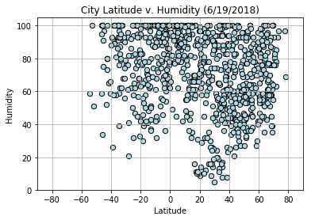

# Observations

* City temperatures peak at +20 N latitude, rather than at the equator. This is likely because the data was pulled in June 19, 2018, a few days before the Northern Hemisphere's Summer Equinox. A year-long data set would likely see temperature peak at the equator, but only same-day weather data is not available from the free tier of the Open Weather Map API.

* City temperatures in the southern hemisphere are clustered more closely together at similar latitudes than in northern hemisphere cities. The southern cities are packed tighter on the 'City Latitude v. Max Temperature' chart, with fewer obvious outliers. This is likely due to narrower non-Antarctic landmasses in the Southern Hemisphere. On the 'City Coordinate Distribution' chart (mirroring a world map), the negative latitude cities are clustered longtitudinally around -60 W (South America), +25 E (Subequatorial Africa), and +150 E (Oceania and much of Indonesia). Positive latitude cities have a much more broad and even longitudinal distribution, reflecting more available landmass East-West and more thus greater potential variability.

* There are no cities further south in latitude than -55 S, corresponding with the southern-most tip of Argentina.

* Humidity, Wind Speed, and Cloud Cover do not have any discernable relationship with Latitude.

```python
#import dependencies

import matplotlib.pyplot as plt
import json
import random
import pandas as pd
from owm_api import key
from citipy import citipy
import requests
```


```python
# Step 1: Generate list of random cities

# Use random to generate a list of lat + long.
# Use citipy to find nearest city to coordinates

cities = []

# This acts as a check to ensure that the generated city in loop is not a repeat
unique_cities_check = []

# Below loop makes up to 10,000 attempts to generate list of 1000 cities with random lat/long generation and CitiPy's nearest_city(). Random coordinate generation results in many duplicates, due the likelihood of the 'nearest city' being on an island in the middle of the ocean or on the edge of continents. From sampling, reaching the desired number of cities takes roughly 3x the iterations (e.g. generating 500 cities takes roughly 1500 iterations). Generating 1000 cities should take roughly 3000 attempts, so 10,000 attemps should be more than sufficient.

# I also expect about 13% of CitiPy generated cities to throw an error when plugged into the Open Weather Map API city search, leaving me with a final sample of roughly 870 cities.

# One of the problem parameters is at least 500 cities. I could hardcode a failsafe to run additional code if final number of cities generated is <500 but it's simpler to generate enough cities that falling below 500 is very unlikely.

for i in range(10000):

    if len(cities) < 1000:
        lat = random.uniform(-90.0,90.0)
        long = random.uniform(-180.0,180.0)
        
        city = citipy.nearest_city(lat,long)
        
        city_country = city.city_name + ' ' + city.country_code
        
        if city_country not in unique_cities_check:
            unique_cities_check.append(city_country)
            cities.append([city.city_name, city.country_code])
                    
    else:
        break
```


```python
# Step 2
# Generate weather data based on the city and country data from OpenWeatherMap API

url = 'https://api.openweathermap.org/data/2.5/weather'

# Weather outputs
weather_data_list = []

for i in range(len(cities)):
    city = cities[i][0]
    country = cities[i][1]
        
    query_params={'q': city + ',' + country,
                  'units': 'imperial',
                  'appid': key}
    
    response = requests.get(url, params = query_params).json()

    # Try-except because not every city in CityPy is found in OWM, about 13% attrition from the 1000 in the cities list
    try:
        weather_data_list.append({'City': city,
                                  'Country': country,
                                  'Longitude': response['coord']['lon'], 
                                  'Latitude': response['coord']['lat'],
                                  'Max Temperature': response['main']['temp_max'],
                                  'Humidity': response['main']['humidity'],
                                  'Cloud Cover': response['clouds']['all'],
                                  'Wind Speed': response['wind']['speed']
                                 })
        
    except:
        pass
```


```python
# Convert to dataframe

cities_df = pd.DataFrame(weather_data_list)

cities_df = cities_df[['City',
                       'Country',
                       'Longitude',
                       'Latitude',
                       'Max Temperature',
                       'Humidity',
                       'Cloud Cover',
                       'Wind Speed']]

cities_df.head()
```


<div>
<style scoped>
    .dataframe tbody tr th:only-of-type {
        vertical-align: middle;
    }

    .dataframe tbody tr th {
        vertical-align: top;
    }

    .dataframe thead th {
        text-align: right;
    }
</style>
<table border="1" class="dataframe">
  <thead>
    <tr style="text-align: right;">
      <th></th>
      <th>City</th>
      <th>Country</th>
      <th>Longitude</th>
      <th>Latitude</th>
      <th>Max Temperature</th>
      <th>Humidity</th>
      <th>Cloud Cover</th>
      <th>Wind Speed</th>
    </tr>
  </thead>
  <tbody>
    <tr>
      <th>0</th>
      <td>karla</td>
      <td>ee</td>
      <td>24.93</td>
      <td>59.37</td>
      <td>62.60</td>
      <td>59</td>
      <td>20</td>
      <td>21.92</td>
    </tr>
    <tr>
      <th>1</th>
      <td>new norfolk</td>
      <td>au</td>
      <td>147.06</td>
      <td>-42.78</td>
      <td>41.00</td>
      <td>80</td>
      <td>40</td>
      <td>9.17</td>
    </tr>
    <tr>
      <th>2</th>
      <td>jamestown</td>
      <td>sh</td>
      <td>-5.72</td>
      <td>-15.94</td>
      <td>71.16</td>
      <td>100</td>
      <td>64</td>
      <td>16.46</td>
    </tr>
    <tr>
      <th>3</th>
      <td>marystown</td>
      <td>ca</td>
      <td>-55.16</td>
      <td>47.17</td>
      <td>50.19</td>
      <td>93</td>
      <td>92</td>
      <td>20.71</td>
    </tr>
    <tr>
      <th>4</th>
      <td>thompson</td>
      <td>ca</td>
      <td>-97.86</td>
      <td>55.74</td>
      <td>62.60</td>
      <td>59</td>
      <td>40</td>
      <td>11.41</td>
    </tr>
  </tbody>
</table>
</div>


```python
# World Map, City Coordinate Distribution

cities_df.plot.scatter('Longitude', 
                       'Latitude',
                       title='City Coordinate Distribution',
                       s=40,
                       ylim=[-90,90],
                       color='LightBlue',
                       edgecolor='Black',
                       grid=True) 
```


    <matplotlib.axes._subplots.AxesSubplot at 0x1117504e0>


```python
# Lat v. Temp

cities_df.plot.scatter('Latitude', 
                       'Max Temperature', 
                       title='City Latitude v. Max Temperature (6/19/2018)', 
                       marker='o', 
                       s=40,
                       xlim=[-90, 90],
                       color='LightBlue', 
                       edgecolor='black', 
                       grid=True)
```


    <matplotlib.axes._subplots.AxesSubplot at 0x1128bb240>


```python
#Lat v. Humidity

cities_df.plot.scatter('Latitude', 
                       'Humidity', 
                       title='City Latitude v. Humidity (6/19/2018)', 
                       marker='o', 
                       s=40,
                       xlim=[-90, 90],                       
                       color='LightBlue', 
                       edgecolor='black', 
                       grid=True)
```


    <matplotlib.axes._subplots.AxesSubplot at 0x11bdfe128>





```python
#Lat v. Clouds

cities_df.plot.scatter('Latitude', 
                       'Cloud Cover', 
                       title='City Latitude v. Cloud Cover (6/19/2018)', 
                       marker='o', 
                       s=40,
                       xlim=[-90, 90],
                       color='LightBlue', 
                       edgecolor='black', 
                       grid=True)
```


    <matplotlib.axes._subplots.AxesSubplot at 0x112864898>


```python
# Lat v. Wind

cities_df.plot.scatter('Latitude', 
                       'Wind Speed', 
                       title='City Latitude v. Wind Speed (6/19/2018)', 
                       marker='o', 
                       s=40,
                       xlim=[-90, 90],
                       color='LightBlue', 
                       edgecolor='black', 
                       grid=True)
```


    <matplotlib.axes._subplots.AxesSubplot at 0x11bfad2b0>


